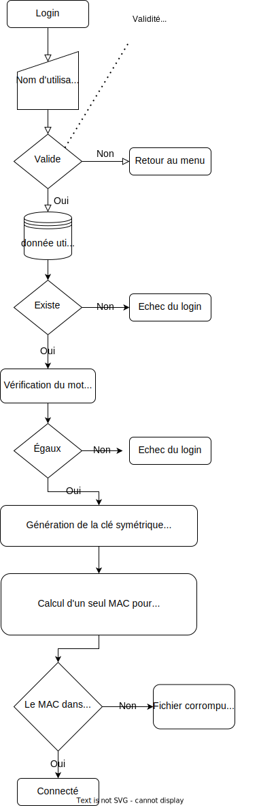
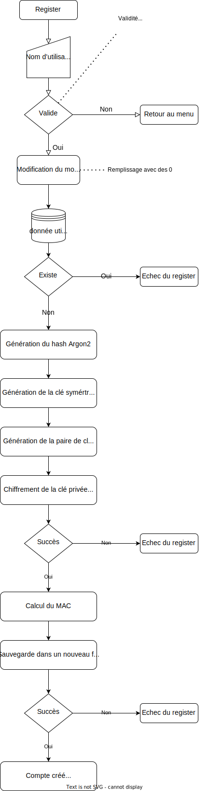

# CAA - Laboratoire 2 - Gestionnaire de mot de passe

Auteur : Axel Vallon

Date : 06.05.2022

## Introduction

Le but de ce rapport est de documenter les sécurités mises en places lors de la création d'un gestionnaire de mot de passe.

Pour rappel, ce gestionnaire de mot de passe doit offrir les fonctionnalités suivantes :

- Connexion avec un mot de passe.
- Création de compte. Le mot de passe utilisé est la seule chose que l'utilisateur doit se souvenir

Un utilisateur connecté peut

- Lire un mot de passe créé ou partagé par un autre utilisateur.
- Ajouter un mot de passe.
- Modifier son mot de passe de base.
- Partager son mot de passe avec un autre utilisateur.

Le tout est sauvegardé en local dans des fichiers, avec chaque utilisateur ayant son propre fichier.

## Langage utilisé

Rust

**Et pourquoi ?**

- Chaque variable est détruite lorsque l'on quitte son contexte. Utile pour une donnée sensible.
- Utilisation de `` crate``  qui implémentent beaucoup de fonctionnalités, dont cryptographique auditée pour la plupart.
- Rust devient de plus en plus dominant dans le marché, et donc l'utiliser me permet d'approfondir mes connaissances de la programmation moderne.
- Rapide.
- **Pour finir avec le plus important** : La connaissance du language. Il n'aurait pas été confortable d'effectuer ce laboratoire en C ou en C++, car je n'aurais pas la confiance de détruire correctement les variables et de savoir utiliser correctement les libraires cryptographique. La plupart des erreurs viennent de la méconnaissance de certains système, et si on peut, il faut choisir la facilité.

## Implémentation

### Fichiers rust

`main.rs`. Main qui effectue les entrées utilisateur et utilise les différentes fonctions dans les modules créés.

`util.rs `: Modules contenant des fonctions pour le main.

`crypto.rs` :  Modules contenant toutes les implémentations des algorithmes cryptographiques utilisées dans ce projet

`files_managers` : Modules gérant les fichiers utilisateur et la sérialisation et la désérialisation des données utilisateur en JSON .

`authentification.rs` : Modules gérant la connexion et l'enregistrement de l'utilisateur.

### Attributs utilisateur

Le fichier utilisateur contient différents éléments permettant de lui faire toutes les opérations. Les attributs utilisés ci-dessus sont les mêmes que les noms de variables utilisés.

**owner** : Nom d'utilisateur. Celui-ci est aussi indiqué dans le nom du fichier associé à l'utilisateur, soit ```./data/owner.json.``` Il doit être constitué de 1 à 32 charactères alphanumériques.

**encrypted_private_key** : Clé privée RSA. Chiffrée et authentifiée avec la clé symétrique de l'utilisateur.  Générée lors de l'enregistrement de l'utilisateur, et fait 2048 bits de long. Lors de la génération, ``rand::rngs::OsRng`` est utilisé pour la randomisation. Elle est déchiffrée et chiffrée à nouveau lors d'un changement de mot de passe, mais pas modifiée.

Elle est utilisée pour déchiffrer un mot de passe partagé par un autre utilisateur et aussi pour signer un message partagé à un autre utilisateur.

**encrypted_private_key_nonce** : Nonce utilisé pour chiffré la clé privée RSA. Généré  avec ``rand::rngs::OsRng``. Un nouveau nonce est généré lors d'un changement de mot de passe.

**public_key** : Clé publique RSA. Authentifiée avec HMAC-SHA256. Dérivée de la clé privée ci-dessus lors de l'enregistrement de l'utilisateur.

Elle est utilisée par un autre utilisateur pour chiffrer un message qu'il veut partager, et par l'utilisateur pour signer ses propre message partagé.

**master_key_hash** : Hash du mot de passe pour vérifier l'authentification de l'utilisateur. Générée avec Argon2id. La configuration utilisée est la suivante. Ce hash est généré lors de son enregistrement, et est modifié lorsque l'utilisateur modifie son mot de passe. Authentifié avec HMAC-SHA256.

```
hash_length = 32 // en bytes
lanes = 1
memory_code = 65_536KB
thread_mode = Sequencial
time_cost = 3
varriant : Ardon2id
version : Version13
```

Génération d'un sel de 128 bit avec ``rand::rngs::OsRng``

**symetric_key_salt** : Sel utilisée pour dériver le mot de passe en clé symétrique. Argon2id est à nouveau utilisé lors de cette opérations. Les paramètres utilisés sont les même que ci-dessus, mais avec une clé``hash_lenght`` de 16 bytes, soit la taille de la clé symétrique. Généré avec ``rand::rngs::OsRng.gen`` pendant l'enregistrement de l'utilisateur, et généré à nouveau lors d'un changement de mot de passe.  Authentifié avec HMAC-SHA256.

**mac** : Authentifie le fichier. Permet de vérifier que les éléments non authentifié par le chiffrements symétrique le soit. HMAC-SHA256 est utilisé comme algorithme. Vérifié pendant que l'utilisateur récupère le fichier, et le modifie lors d'une modification des données.

**passwords** : Hashmap des mots de passe locaux. La clé est le label, et chaque label est donc unique. Chaque ajout de mot de passe met à jour son contenu. Chaque mot de passe contient le mot de passe chiffré avec la clé symétrique, et le nonce associé. Chaque mot de passe ajouté est de base un vecteur de 128 bytes.

**shared_passwords**: Hashmap des mots de passe partagé par d'autres utilisateurs. La clé de cette hashmap est le nom du compte qui l'a partagé et le label, ce qui permet que plusieurs utilisateurs peuvent partager le même label à une personne.

Le contenu associé est le mot de passe chiffré avec la clé publique de l'utilisateur et la signature de ce mot de passe est générée avec la clé publique de la personne qui a partagé ce mot de passe. Lors d'une lecture, la clé publique de l'utilisateur distant est récupérée dans le fichier distant.

****

### Diagramme login 



Il a été décidé de montrer un flowchart afin d'expliquer le processus de login. Si vous souhaitez plus d'information concernant les type, vous pouvez vous référer au code.

Une analyse de sécurité est effectuée plus loin dans ce document.

### Diagramme création de compte



Il a été décidé de montrer un flowchart afin d'expliquer le processus de login. Si vous souhaitez plus d'information concernant les type, vous pouvez vous référer au code.

Une analyse de sécurité est effectuée plus loin dans ce document.

### Autres fonctionnalités

Les fonctions pour lire un mot de passe, ajouter un mot de passe, modifier un mot de passe et partager un mot de passe ont été crées pour respecter les données utilisateur est garder un état cohérents pour toutes ces options.

Vous pouvez vous référer au code pour toute informations liées à l'implémentations.

## Sécurité

### Modèle d'adversaire

Pour créer cette sécurité, il a été identifié que l'adversaire pouvait faire ceci :

- Visualisation de la mémoire.
- Mesure des temps d'exécution.
- Lecture et modification du fichier utilisateur.
- Bonne connaissance des algorithmes utilisés.

### Taille des clés

Les recommandations de l'ANSSI seront utilisée pour les différentes taille de clé.

### Choix du générateur de nombre aléatoire

Il a fallu sélectionner en premier lieu quel générateur de nombre aléatoire allait être utilisé quand ils sont nécessaire. Il en existe deux types, les "[Basic pseudo-random number generators (PRNGs)](https://rust-random.github.io/book/guide-rngs.html#basic-pseudo-random-number-generators-prngs)" et les "[Cryptographically secure pseudo-random number generators (CSPRNGs)](https://rust-random.github.io/book/guide-rngs.html#cryptographically-secure-pseudo-random-number-generators-csprngs)".

Le deuxième choix est celui sélectionné car il permet d'avoir une distribution uniforme. 

**Choix : ** `rand::rngs::OsRng` a été sélectionné malgré les nombreux CSPRNGs.

- Il implémente le trait `RngCore`, et certaines fonctions cryptographique en ont besoin.
- Il récupère de l'entropie de l'OS. Comme la solution actuelle est basée sur un client, utiliser toute autre source entropie serait infaisable, car manipulable. La source d'entropies sur les différents OS est très bien documentée.
- Il implémente aussi le trait `CryptoRng`, qui déclare qu'une implémentation est sensé être cryptographiquement sûre.

D'autre respectent aussi ces conditions mais sont moins bien documentées sur la source d'entropie. 

### Authentification de l'utilisateur

Afin que l'utilisateur puisse s'authentifier, on est obligé d'utiliser une façon de stocker quelque part un moyen de s'assurer que l'utilisateur est qui il est. Il serait possible de garder le mot de passe en clair, mais cela impliquerait les erreurs critiques suivantes: 

- Un attaquant pourrait récupérer le mot de passe en clair dans le fichier.
- Un attaquant pourrait se connecter au compte est déchiffrer tous les mots de passe.
- Un attaquant pourrait déchiffrer la clé privée, et se faire passer pour l'utilisateur original auprès des autres utilisateurs.
- Et d'autre... Il a accès à tout.

Alors l'utilisation d'une fonction de dérivation de clé a été jugée indispensable.

Pour ce faire, la fonction Argon2 a été séléctionnée. Elle a été sélectionnée pour les points suivants :

- A remporté la "Password Hashing Competition" en 2015. Source : https://www.password-hashing.net/.
- Argon2 est configurable. On peut définir approximativement le temps de création d'un mot de passe. Plus on met de mémoire et de temps, plus l'attaquant mettra du temps à bruteforcer un mot de passe. 
- Utilise un sel, ce qui permet d'éviter des "rainbow table attack"

**Choix du variant**

Pour configurer Argon2, Il a déjà choisir le variant de celui-ci. 

Il en existe 3 :

- Argon2d : Protège contre les attaque avec des GPU (plus de mémoire)
- Argon2i : Protège contre les attaque par canal auxiliaire.
- Argon2id : Protège les deux

Dans ce cas, comme l'attaquant a accès a tout, il faut prendre ces deux primitives, et donc **Argon2id**.

**Choix des paramètres**

Argon2 propose diverse options pour prolonger les temps de calcul. En premier, nous avons mis le nombre de thread à 1 et n'apporte pas grand chose. 

Ensuite, il a fallu définir la quantité de mémoire utilisée était adéquat sur un client desktop, et 64Kb a été jugé cohérent. Plus pourrait être très ennuyeux sur des micro-ordinateur. 

En dernier, il a fallu définir le temps exécution acceptable pour un utilisateur. L'approche utilisée a été de la mettre à 1, et monter graduellement jusqu'à arriver à un temps de login entre 1 à 5 secondes (temps d'attente acceptable pour la UX en Desktop), soit avec la valeur 3.

**Configuration finale**

```
hash_length = 32 // en bytes
lanes = 1
memory_code = 65_536KB
thread_mode = Sequencial
time_cost = 3
varriant : Ardon2id
version : Version13
```

### Génération de la clé symétrique

L'utilisateur a besoin d'un secret dérivé depuis son mot de passe pour chiffrer et déchiffrer ses donnée. Pour ce faire, Argon a été utilisée de la même manière qu'avant que pour le Hash.

Cependant, un autre sel est généré, et seulement la fin du hash est utilisée pour la clé symétrique, car le début contient des informations sur les paramètres de Argon2.

Cette génération de clé n'est pas optimale, mais permet d'éviter tout brute-force sur le mot de passe de l'utilisateur.

**Preuve**

Si on dérivait simplement le mot de passe avec une HKDF, alors l'attaquant pourrait faire bruteforce la fonction d'hkdf en dehors du programme, et après calculer le MAC du fichier avec le résultat, et observer si le mac sauvegardé est le même. Le soucis est que HKDF et HMAC-SHA256 sont deux fonctions rapide, et donc on pourrait bypass la sécurité du hash avec Argon2.

**Configuration**

Pour la preuve ci-dessus, il faut que les ressource utilisées pour générer le clé symétrique soient équivalente ou presque à la génération du Hash.

### Chiffrement symétrique

Pour chiffrer les données et pouvoir les déchiffrer, il est nécessaire d'utiliser du chiffrement symétrique.

Après analyse, deux type de données devront être chiffrée et pouvoir être récupérable .

- La clé privée RSA, qui dépasse la taille d'un bloc de chiffrement
- Les mot de passe ajouté par l'utilisateur, qui a une taille variable de base.

De plus, comme les données seront stockée dans un fichier accessible par un attaquant, il faut protéger l'intégrité de ces données. 

**Choix de l'algorithme**

Il existe un certains nom d'algorithme de chiffrement authentifiée sécurisé. Cependant, il faut en trouver une qui est valide en Rust. 

Pour ce faire, nous somme allé sur le site https://cryptography.rs/ qui liste les librairies de cryptographique de bonne qualité en Rust. Dans ce document, on y trouve plusieurs librairies de chiffrement authentifié. Une version audité de AES-GCM y figures. C'est celui-ci qui a été donc séléctionné.

**AES-GCM**

Il s'agit d'un algorithme de chiffrement par flot, et qui génére un tag qui permet de vérifier l'authenticité du message.

Il y a trois points importants concernant son utilisation :

- Comme c'est un chiffrement par flot, alors la taille de la sortie sera la même que la taille de l'entrée. Si l'on prend nos deux cas de chiffrement, la taille de la clé RSA est connues, donc ce n'est pas un problème. Cependant, la taille des mots de passe est problèmatique. Si on a un mot de passe de 4 charactère, alors le mot de passe chiffré correspondant ferait aussi 4, est divulguerait des informations sur la clé. Pour ce faire, tout les mot de passe en clair sont étendu en vecteur de 128 bytes.
- Le nonce ne doit pas être réutilisé. Pour ce faire,  le même CSPRNGs qu'auparavant est utilisé pour générer un nouveau nonce pour chaque mot de passe. Statistiquement, il faudrait générer 2^48 mot de passe pour avoir une bonne probabilité que deux mot de passe aie le même nonce. Ce qui est très peu probable.
- La taille des messages est limitées, il ne faut pas dépasser les compteur. La taille des mots de passe utilisés n'est pas impactée.

**Configuration**

Nonce size : 96 bits (Default).

AES key : 128 bits.

Tag size : 128 bits.

### Chiffrement asymétrique

Comme il est nécessaire de partager des mots de passe entre les utilisateurs, il est obligatoire de pouvoir trouver un moyen d'avoir un secret partagé entre eux. Il existe deux options :

- Créer un secret partagé pour chaque paire d'utilisateur en contact. Mais ce serait compliqué à maintenir et à générer.
- Chaque utilisateur a sa paire de clé asymétrique. 

La deuxième option est viable mais entraine un soucis de sécurité. Il s'agit de la solution mise en place.

**Algorithmes utilisé**

Pour sélectionner l'algorithme, nous avons trouvé à nouveau une librairie auditée et RSA y était disponible. Il a été choisi car il fait partie du PKCS. Il faut faire attention au "RSA padding oracle attack". Mais si RSA-OAEP est utilisé, ce ne devrait pas être possible.

Pour l'échanger de message, RSA-OAEP est utilisée. ça implémente un padding assez sûre, est sécurisé contre les attaques à texte choisi. 

Pour les signature de message, RSA-PSS est utilisées. C'est un algorithme créé pour les signature RSA.

Tout les algorithme de hash sont SHA-256. Cet algorithme est suffisant, et permet d'éviter les collision.

**Chiffrement et déchiffrement**

Chiffrement RSA : Chiffrer du contenu avec la clé publique du destinaire et signe avec la clé privée.

Déchiffrement RSA : Déchiffre avec sa clé privée et vérifier l'authenticité avec la clé publique de l'émetteur.

**Configuration**

Taille de clé privée RSA : 2048 bit. Recommandé par l'ANSSI.

## Sécurité de l'implémentation

Ce paragraphe contient les sécurités mise en place liées à la consigne, et ce que l'attaquant devrait faire pour les bypass.

### Utilisateur non connecté

#### Récupérer les mot de passe

Il est très compliqué pour un attaquant de récupérer les mot de passe chiffré car il sera obligé de brute-force l'authentification avec Argon2.

L'autre possibilité serait de brute-force AES-GCM en connaissant un des mot de passe en clair, mais il faudrait essayer toute les permutation de clé de 128 bits. C'est actuellement impossible.

#### Récupérer le mot de passe de l'utilisateur

Il est obligé de brute-force Argon2 avec des paramètres qui bloqueront l'attaquant. Il faudrait investir des années et des millions de dollar pour ceci.

### Utilisateur connecté

#### Récupérer le mot de passe de l'utilisateur

Comme le mot de passe de l'utilisateur est dérivé directement, et détruit, il reste seulement un laps de temps très court dans la mémoire, et ce serait compliqué pour un attaquant de le récupérer. 

#### Récupérer les mot de passe non accédé

Seulement les mots de passe accédé son ajouté dans la mémoire. Lors ce que l'utilisaeur quitte le contexte de récupération d'un mot de passe, ceux-ci sont supprimé de la mémoire.

Cependant, il peut théoriquement récupérer la clé symétrique dans la mémoire, et tout déchiffrer. La clé symétrique fait office de token de connexion quand il est connecté.

## Attaques possible avec la solution actuelle

### Problème 1

Comme il n'est pas possible d'authentifier un utilisateur avec son fichier, un attaquant peut modifier la clé publique d'un utilisateur dans son fichier, et attendre qu'un utilisateur partage une clé. Comme le partage est effectué avec la nouvelle clé publique, l'attaquant pourra lire le mot de passe en clair avec sa propre clé privée

**Solution** :

Il faudrait mettre en place un serveur qui authentifie la clé publique de chaque utilisateur avec sa propre clé privée, avec le nom de l'utilisateur associé. Ensuite, quand on récupère la clé publique d'un autre utilisateur, on vérifie avec la clé publique du serveur que la signature est la bonne.

Il faut faire attention que la clé publique du serveur soit authentique.

### Problème 2 (cas complexe)

Le chiffrement avec RSA est déterministe. Cela veut dire qu'un utilisateur peut faire une attaque où il récupère les mot de passe partagé chiffré sur un compte et la clé publique, et essaie de brute-forcer plein de mot de passe en clair en les chiffrant avec cette clé publique, et regarde si le mot de passe est le même.

Cela reste une attaque assez compliquée car le chiffrement RSA est lent, mais trivial sur un mot de passe très simple.

**Rappel : Chiffrement RSA**


m est le mot de passe que l'attaquant veut essayer de comparer, et e la clé publique.

### Problème 3 (cas rare)

Le chiffrement avec RSA est déterministe. Si un utilisateur reçu deux fois le même mot de passe, il seront identiques.